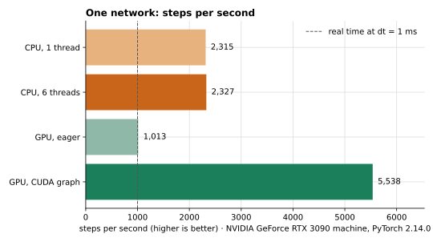
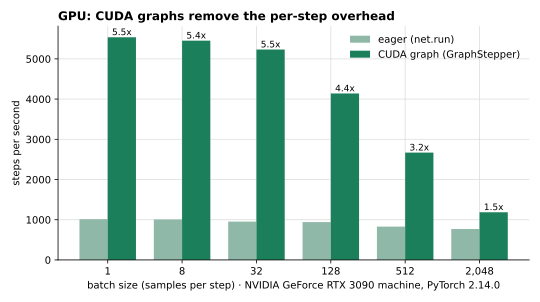
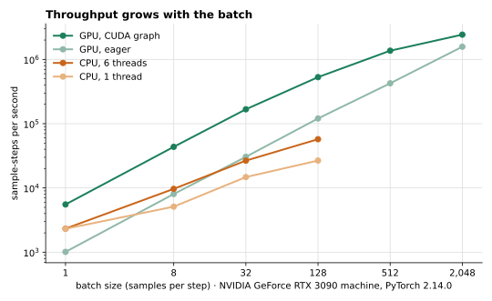

# Benchmarks

How fast neuroSush simulates, and how to get the most out of a CPU or a GPU. Every number
here comes from `benchmarks/scaling.py` and can be reproduced (see the end), and the raw results are in
[`figures/scaling-rtx3090.json`](figures/scaling-rtx3090.json).



## The workload

`benchmarks/dense_stdp.py`: 784 inputs (an MNIST-sized frame, 5% of them spiking every step)
drive 400 LIF neurons with dendrites through a dense synapse group that learns with
soft-bounded STDP. The outputs compete (k-winners-take-all, k = 5), adapt their thresholds
(activity homeostasis) and have their incoming weights normalized: 313,600 plastic synapses.

A *step* is one simulation time step of the whole network. With `Network(batch_size=B)` a
step advances `B` independent samples that share the weights; *sample-steps* counts steps
times batch size.

## Machine and method

| | |
|---|---|
| GPU | NVIDIA GeForce RTX 3090 (24 GB) |
| CPU | Intel Core i5-14400F (6 performance + 4 efficient cores) |
| Software | Windows 11, Python 3.12.10, PyTorch 2.14.0+cu130 |

Every measurement builds a fresh network, runs 20 warm-up steps and times 300 steps;
the tables show the median of three runs. The benchmark ran at high priority on the
performance cores (see *Pitfalls*). All numbers come from this one machine.

## GPU

*Eager* runs `net.run`; *graph* replays the step as a CUDA graph (`GraphStepper`), which gives
bit-for-bit the same results.

| batch | eager steps/s | graph steps/s | graph sample-steps/s | graph speedup |
|---:|---:|---:|---:|---:|
| unbatched | 1,013 | 5,538 | 5,538 | 5.5x |
| 8 | 1,006 | 5,454 | 43,629 | 5.4x |
| 32 | 953 | 5,233 | 167,449 | 5.5x |
| 128 | 942 | 4,139 | 529,812 | 4.4x |
| 512 | 830 | 2,669 | 1,366,343 | 3.2x |
| 2,048 | 769 | 1,186 | 2,428,474 | 1.5x |



(Batch 1 in the figures means an unbatched network.)

## CPU

| batch | 1 thread: steps/s | 6 threads: steps/s | 6 threads: sample-steps/s |
|---:|---:|---:|---:|
| unbatched | 2,315 | 2,327 | 2,327 |
| 8 | 640 | 1,210 | 9,683 |
| 32 | 461 | 832 | 26,619 |
| 128 | 209 | 448 | 57,349 |

## Throughput



## What the numbers say

- **Use CUDA graphs on a GPU.** Eager stepping spends most of a step launching dozens of
  tiny kernels; replaying a captured graph removes that cost. A single network runs
  **5,538 steps/s** (5.5x eager). With `dt = 1 ms` that is 5.5x faster than real time, and
  2.4x the best CPU result for one network (2,327 steps/s).
- **Batch for throughput.** A graph step costs almost the same for 1 or 32 samples, so
  throughput grows with the batch, up to **2,428,474 sample-steps/s at batch 2,048** (42x
  the best CPU result). At 350 steps per sample (a 350 ms presentation, as in Diehl and
  Cook 2015) that is about 6,938 samples per second.
- **On a CPU, batching helps too, and more threads help batches.** With PyTorch 2.14.0,
  one and six threads run a single network equally fast; with six threads a batch of 128
  reaches 57,349 sample-steps/s. With older PyTorch versions, one thread was faster than
  several for a single network: try `torch.set_num_threads(1)` on yours.

## Pitfalls that change the numbers

- **Efficient cores and background priority.** On CPUs with performance and efficient cores,
  Windows runs background processes (for example a job started over SSH) on the efficient
  cores at low priority. Eager stepping then ran about half as fast, on the GPU too,
  because the CPU launches the GPU's work. On Windows, start long runs with
  `start "" /b /wait /high /affinity FFF python ...` (the mask selects this CPU's twelve
  performance-core threads; use your CPU's own).
- **A throttled CPU.** A CPU below its normal clock slows every step, including GPU steps in
  eager mode. A laptop on a low-power charger can be held at a small fraction of its clock:
  check the current frequency under load before trusting a measurement.
- **Graph-ready behaviors.** `GraphStepper` needs every behavior of the step to be
  graph-ready (see the README); networks with reward (`Payoff`, `Dopamine`, `RSTDP`) or with
  delays longer than one step run eagerly.

## Reproduce

```bash
pip install -e ".[dev]"   # with a CUDA build of PyTorch for the GPU rows
python benchmarks/scaling.py --cpu-threads 1,6 --out scaling.json
```

`--gpu-batches`, `--cpu-batches`, `--steps` and `--repeats` change what is measured; the
results, with a description of the machine, go to the JSON file.
`python benchmarks/plot_scaling.py scaling.json figures/` draws the three figures from it
(it needs matplotlib).

## Tracking speed over time

The Benchmarks workflow runs `benchmarks/suite.py` every week on a GitHub runner: the dense
network (unbatched and at batch 32), spatial pooler learning and temporal memory learning,
each divided by a calibration workload measured on the same machine. It fails when a case
loses half of its baseline speed. Runners differ by up to about 25% on unchanged code, so
smaller changes are reported but not treated as regressions.
